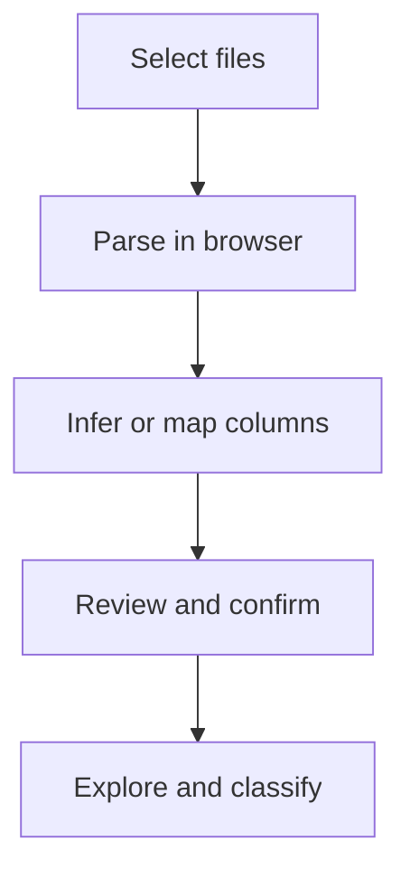

# My Expense Map

My Expense Map is a privacy-first, bilingual expense explorer. Import transaction exports in your browser, review the result, and drill down from the total to domains, categories, months, and individual transactions.

**[Open the live application](https://nsharet.github.io/myExpenseMap/)**

The interface supports Hebrew and English, automatically switching between RTL and LTR layouts.

## What you can do

- Explore expenses as a ranked list or an interactive pie/donut chart.
- Move through total → domain → category → month → transaction detail.
- Search and sort the relevant views.
- Print the current report or save it as a PDF from the browser.
- Correct one transaction's classification or apply a correction to every matching merchant.
- Manage and export browser-local classification rules.
- Use the built-in synthetic demo without importing a file.

Category icons remain visible in the chart legend. The chart itself stays uncluttered: hovering over or focusing a slice shows its icon nearby, and clicking it opens the next level.

## Import your data

1. Select or drag one or more supported files into the upload area.
2. The browser reads each file locally and looks for transaction tables.
3. The importer infers the **date**, **merchant/description**, and **amount** columns.
4. If those required fields cannot be identified confidently, map them manually.
5. Review accepted transactions, skipped rows, warnings, and excluded duplicates.
6. Confirm the preview to replace the demo data for the current session.
7. Explore the map and correct classifications where needed.



### Supported input

| Format | Current handling |
| --- | --- |
| CSV | One tabular dataset |
| XLS / XLSX | Up to 10 non-empty worksheets per workbook |
| JSON | An array of transaction objects, either at the root or as the first array-valued property |

Current limits:

- Maximum file size: **15 MB per file**.
- Maximum processed rows: **20,000 per table or worksheet**.
- Required semantic fields: **date**, **merchant/description**, and **amount**.
- Optional fields, when recognized: currency, card/account, owner, installment position, total installments, and original purchase amount.

Column recognition is generic and based on headers and sample values; the application does not maintain a fixed list of supported banks or card providers.

### Financial behavior

- Expenses remain positive amounts.
- Credits and refunds remain negative and reduce totals at every drill-down level.
- A group containing both charges and refunds shows the net amount.
- Net-negative groups and transactions are highlighted in green, including in the pie view.
- Installment metadata is preserved when the source provides it. The current monthly charge is the amount included in the totals.
- Duplicate detection compares date, normalized merchant, amount, card/account, and installment position. This prevents an exact duplicate from being imported while preserving distinct installments.
- Imported records enter the existing classification system. A merchant-level correction applies to all transactions with the same normalized merchant name; a single-record correction is also available.

## Privacy and persistence

Parsing and normalization happen entirely in the browser. Files and parsed financial records are **not uploaded to a server or AI service**.

Imported records are held in memory only. Refreshing or reopening the application clears them, so the files must be imported again. Classification rules, language, and view preference may remain in that browser through `localStorage`.

The public repository contains synthetic demo data only:

- [`data/demo-expenses.json`](data/demo-expenses.json)
- [`data/demo-category-rules.json`](data/demo-category-rules.json)

Do not commit real statements, transaction exports, merchant histories, account identifiers, or personal classification rules. User accounts and private cloud persistence are not implemented.

## Current limitations

- Unusual spreadsheets may require manual mapping of the three required columns.
- Tables whose headers are not on the first table row may not be detected reliably.
- Input must contain tabular transaction data; free-form documents are not supported.
- There is no long-term financial-data storage, user account, direct bank connection, server-side processing, or AI extraction.
- Installment metadata is retained internally but is not yet shown as dedicated fields in transaction detail.

## Development

### Prerequisites

- Node.js 20 or newer
- npm

Install dependencies and start Vite:

```bash
npm install
npm run dev
```

Spreadsheet and CSV parsing is provided by [SheetJS (`xlsx`)](https://docs.sheetjs.com/). JSON parsing uses the browser's built-in JSON support.

### Tests, build, and preview

Run the unit tests:

```bash
npm test
```

Playwright requires a browser installation once per environment:

```bash
npx playwright install chromium
npm run test:e2e
```

The E2E suite runs desktop and narrow-viewport projects. Create and serve a production build with:

```bash
npm run build
npm run preview
```

The production build uses the `/myExpenseMap/` GitHub Pages base path and writes output to `dist/`.

### Project structure

```text
.github/workflows/deploy-pages.yml  GitHub Pages CI/CD
data/                               Synthetic demo data and rules
docs/adding-a-language.md           Localization extension guide
e2e/pie-chart.spec.ts               Playwright interaction coverage
src/App.tsx                         Explorer and classification UI
src/Onboarding.tsx                  File selection and import review flow
src/imports.ts                      Parsing, inference, normalization, and deduplication
src/PieChartView.tsx                Interactive donut view
src/pie-chart.ts                    Pie geometry helpers
src/classification.ts               Merchant normalization and classification rules
src/i18n/                            Hebrew/English resources and taxonomy
```

To add another language, follow [`docs/adding-a-language.md`](docs/adding-a-language.md).

## GitHub Pages deployment

The [`deploy-pages.yml`](.github/workflows/deploy-pages.yml) workflow installs dependencies, runs the unit suite, builds the application, and deploys `dist/` after every push to `main`. It can also be started manually with `workflow_dispatch`.

Repository administrators must select **Settings → Pages → Build and deployment → Source → GitHub Actions** once before the first deployment.
